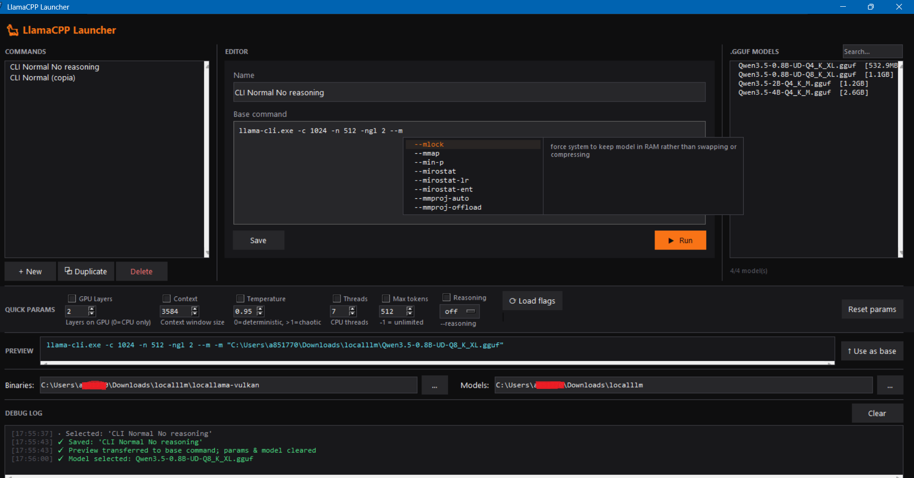

# llamacpp-launcher 

A lightweight utility to manage, compose, and execute llama.cpp commands.

Just specify the binaries path and models path, then create commands, choose the model you want to run, and execute them with ease.

## Features

- Simple and intuitive interface.
- Interactive command composition.
- Compose, save, and run llama.cpp commands.
- Automatic extraction and parsing of `--help` output for argument suggestions and autocomplete.
- Process memory monitoring.
- Multiline command args ( '\' ).




## How to Run

Make sure you have Python installed on your system.

Then simply run:

```bash
python.exe llamacpp-launcher.py
```
## Configuration

All settings and saved commands are stored in a local configuration file:
```
~/llama_launcher.json
```
